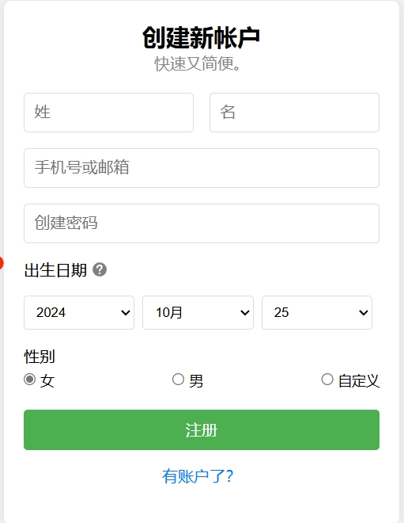

# 前端第一次作业：注册表单

## 1.实现简单的页面布局

1. 对于作业要求来说，首先应当尽量先还原页面的样子，首先设置若干个块，分别为姓，名，手机号码或邮箱，创建密码，出生日期，以及三个选择栏（年，月，日），性别以及三个选择项（男，女，自定义）。并将这些块放入一个块内，形成一个主页面。

   以下是一个例子：（其余的大致相同）

   ```html
   <div style="margin-right: 16px;">
       <input type="text" id="lastName" placeholder="姓">
       <span id="lastNameError" class="error-message" style="display:none;color:red;">请输入姓</span>
   </div>
   ```

2. 同时我们注意到该页面需要提交信息，需要用到表单，所以将以下所有块放入表单之内，方便表单的信息提交。并且设置一个注册按钮，作为表单的提交按键。 “有账户了？”样式应为一个链接，可用<a>标签实现

   ```html
   <button type="submit" class="btn">注册</button>
   <p class="login">有账户了？</p>
   ```

3. 做完以上步骤后，发现与所给页面略有不同，其中最主要的是姓和名两个块并未分布在同一行，而是在上下两行分布，经查阅资料，得到解决方法。

   ```html
   <div style="display: flex; justify-content: space-between; align-items: center;">
    (其中内容为姓和名两个块的代码，此处不再赘述)
   </div>
   ```

   

4. 接下来不断调整所有块的css样式，得到的大致页面布局如下：(暂时忽略icon问号图标，此时尚未实现)

   

   

   

   ## 2.对出生日期和性别两个选择框的优化

   ##### 1.对性别选择的优化：

   ​	对性别选择的优化较为简单，只需对三个“radio”单选按钮进行绑定onclick鼠标事件，并通过checked指定“女”为默认值。

   ​	鼠标事件的json代码如下：

   ```json
   function toggleCustomGender() {
       // 获取自定义性别的输入框
       const customGenderInput = document.getElementById('custom-gender');
       
       // 获取当前选中的性别选项
       const customGenderRadio = document.querySelector('input[name="gender"]:checked').value;
       
       // 如果选择的是"自定义"，显示输入框，否则隐藏
       if (customGenderRadio === '自定义') {
           customGenderInput.style.display = 'block';
       } else {
           customGenderInput.style.display = 'none';
       }
   }
   ```

   ​	即当选择自定义性别的时候，将会弹出一个input互动框，方便输入性别，而如果是男女，则不会。

   

##### 2.对出生日期的优化：

​	对出生日期的优化主要可分为以下三个部分：

- 默认日期为当前日期
- 根据年月的不同，确定当月共有几天（如2023年1月有31天，2月只有28天）

首先一定要获得当前日期和select元素，经过循环，从当前年份开始，循环150次，将不同的年份加入yearSelect元素中，月份选项同理。日则需要根据年月，对临界变量进行不同的赋值，如(31,30,29,28)。当循环遍历时，碰到当前的年，月，日，将其selected元素设为true，即可设置默认日期为当前日期。

- 对年月选择器增加监听器，当年份月份发生改变时，重新生成日


## 3.对姓，名，密码，邮箱以及表单提交添加正则表达式约束

1. 对姓，名，密码，手机号或邮箱增加表达式约束：

   根据input标签中的patterns元素即可实现，正则表达式分别为：

   ```html
   <input type="text" id="lastName" placeholder="姓" 
                       pattern="[\s\S]{0,3}" title="姓和名不为空，最多3个字符">
   <input type="text" id="firstName" placeholder="名" 
                       pattern="[\s\S]{0,3}" title="姓和名不为空，最多3个字符">
   <input type="email" id="email" placeholder="手机号或邮箱" 
                   pattern="^\d{11}$|^\w+@\w+\.com$" title="请输入11位手机号或符合 ***@**.com 形式的邮箱">
   <input type="password" id="password" placeholder="创建密码" 
                   pattern="^[\w]{6,16}$" title="密码为6~16位数字、字母、下划线">
   ```

   并且设置title属性，当鼠标悬浮在对应的input框中，会有相关的提示出现

2. 如果姓名密码邮箱都通过检验，则表单可以提交，否则不可以提交


## 4.对出生日期和性别旁添加icon图标

在出生日期和性别旁添加图标的方式一模一样，这里只简述对出生日期旁的icon图标的设置

1. 查询阿里的iconfont，找到对应的问号图标，下载代码。

2. 图标有三种方式表示（unicode，font class，symbol），在这里我选择了用symbol方式引入图标，原因是可以显示出图标的颜色。

   引用方式如下：

   ```html
    <svg class="icon info-icon" aria-hidden="true">
                           <title>点击查看更多</title>
                           <use xlink:href="#icon-bangzhu"></use>
                       </svg>
   ```

3. 接下来将该图标调整svg图像的属性，使得图标位于出生日期旁

4. 设置悬停提示框：使用title标签。

5. 设置点击弹出框，采用popover属性设置弹出框，默认其display属性默认为“none”，默认不展示

   ```html
     <div class="popover" id="popover-info1">
                   <strong>提供你的出生日期</strong> 将确保提供与你年龄相符的使用体验。详细信息，请参阅我们的<a>隐私权政策</a>。
               </div>
   ```

   并对svg图像增加事件监听器，当接收到点击事件时，则切换弹出框状态，当点击其他部分时，隐藏弹出框。基本代码如下：

   ```js
   // 为SVG图标添加点击事件监听器
   svgIcon1.addEventListener('click', function(event) {
       event.stopPropagation(); // 阻止事件冒泡到document
       // 切换提示框的显示状态
       popover1.style.display = (popover1.style.display === 'none' || popover1.style.display === '') ? 'block' : 'none';
   });
   
   // 为document添加点击事件监听器
   document.addEventListener('click', function() {
       // 如果点击的不是SVG图标或其内部元素，则隐藏提示框
       if (!svgIcon1.contains(event.target)) {
           popover1.style.display = 'none';
       }
   });
   
   ```


## 5.对姓，名等输入框的错误提示优化

同样对姓，名等输入框加入红色感叹号icon图标，这里以姓来举例。

```html
               <div style="margin-right: 16px; position: relative;">
                   <input type="text" id="lastName" placeholder="姓" 
                          pattern="[\s\S]{0,3}" title="姓和名不为空，最多3个字符" oninput="validateInput(this)">
                   <span id="lastNameError" class="error-message" style="display:none;color:red;">请输入姓</span>
                   <svg class="icon error-icon" id="lastNameErrorIcon" aria-hidden="true" style="display:none; position: absolute; right: 8px; top: 50%; transform: translateY(-50%);">
                       <use xlink:href="#icon-gantanhao"></use>
                   </svg>
               </div>
```

 

当不符合输入要求时，显示错误图像和消息，并将边框变红

```json
function validateInput(inputElement) {
    const pattern = new RegExp(inputElement.getAttribute('pattern')); // 获取输入框的 pattern
    const errorMessage = inputElement.nextElementSibling; // 错误消息
    const errorIcon = errorMessage.nextElementSibling; // 错误图标 SVG

    // 检查输入是否符合 pattern
    if (!pattern.test(inputElement.value) || inputElement.value === '') {
        errorIcon.style.display = 'block'; // 显示错误图标
        inputElement.style.borderColor = 'red'; // 边框变红
    } else {
        errorMessage.style.display = 'none'; // 隐藏错误消息
        errorIcon.style.display = 'none'; // 隐藏错误图标
        inputElement.style.borderColor = ''; // 恢复默认边框颜色
    }
}

```


此时所有功能已经基本实现